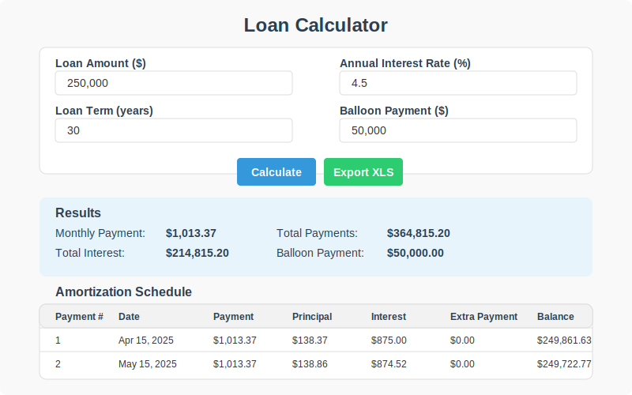

# Loan Calculator

An interactive loan calculator with advanced features including balloon payment options, multiple currency support, and Excel export capabilities.

## Features

- **Basic Loan Calculation**: Calculate monthly payments, total interest, and amortization schedules
- **Balloon Payment Support**: Option to leave a specific sum at the end of the loan term
- **Extra Payment Analysis**: See how additional monthly payments affect your loan
- **Multiple Currencies**: Support for USD, EUR, GBP, JPY, CAD, AUD, and CHF
- **Payment Frequency Options**: Monthly, bi-weekly, or weekly payment schedules
- **Excel Export**: Export complete loan analysis to Excel format with summary and amortization sheets
- **Interactive Amortization Table**: See a detailed breakdown of each payment

## Usage

### Online Version

Visit the [GitHub Pages site](https://dimitrigeelen.github.io/loan-calculator/) to use the calculator online.

### Local Usage

#### Option 1: Direct Browser Open
1. Clone this repository
2. Open `index.html` in any modern web browser
3. No installation or server required - runs completely in the browser

#### Option 2: Using the Web Server
1. Clone this repository
2. Ensure you have Node.js installed (v14.0.0 or higher)
3. Run the server using one of these methods:
   - Simply run: `node server.js`
   - Or use npm: `npm start`
   - For development with auto-reload: `npm install` then `npm run dev`
4. Open your browser and navigate to http://localhost:3000

The web server provides the following benefits:
- Proper MIME type handling for all file types
- Better simulation of a production environment
- Automatic reloading during development (with `npm run dev`)
- Can be used to host the calculator on an internal network

### Google Sheets Templates

The `templates` folder contains CSV files that can be imported into Google Sheets:

- `loan_calculator.csv` - Basic loan calculator
- `loan_calculator_with_balloon.csv` - Loan calculator with balloon payment option

## How to Import to Google Sheets

1. Open Google Sheets (https://docs.google.com/spreadsheets)
2. Create a new blank spreadsheet
3. Go to File > Import > Upload
4. Select the CSV file from the templates directory
5. Choose "Replace spreadsheet" in the import options
6. Click "Import data"

**Note**: After importing, you may need to replace semicolons (;) with commas (,) in the formulas depending on your locale settings.

## Excel Export

The "Export to XLS" button creates an Excel file with:

1. A summary sheet containing all loan parameters and results
2. An amortization schedule sheet with the complete payment table

The Excel file preserves numeric values for further analysis.

## Understanding Balloon Payments

A balloon payment is a lump sum that remains at the end of the loan term. This feature is useful for:

- Commercial real estate loans
- Situations where you plan to sell before the loan matures
- When you expect to refinance at a specific point
- Lowering monthly payments with plans to pay a lump sum at the end

## License

MIT License - feel free to use and modify as needed.

## Contributing

Contributions are welcome! Please feel free to submit a Pull Request.
